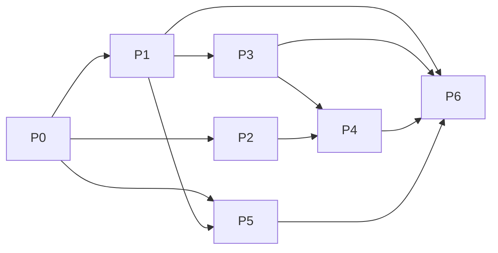

# AI-Powered Smart Lending Decision Hub — MASTER Implementation Guide

| Field | Value |
|---|---|
| Document | 00_MASTER — index & contract for the phase file set |
| Version | 1.0 · 31 August 2026 |
| Parent | *AI-Powered Smart Lending Decision Hub — SRS & Algorithm Design v1.0* ("the SRS"; §-references in every phase file point there) |
| File set | This master + 7 phase files (`Phase_0` … `Phase_6`), one file per phase |

---

## 1. How this document set works

- **This master file** holds everything that is shared across phases: the anti-hallucination grounding contract, the phase gate protocol, the shipping ladder, the frozen definitions (Appendix A), and the phase index.
- **Each phase file** is self-contained for execution: objective, entry criteria, inputs/outputs, step-by-step build (basic algorithm → challenger → validation → shipping), deliverables checklist, exit criteria, and that phase's "do not invent" list. A team (or an AI coding agent) working on one phase should load **this master + its one phase file** — nothing else is required, and nothing outside them may be assumed.
- **Precedence:** SRS (design intent) > Master (shared contract) > Phase file (execution detail). Conflicts are raised as tickets, never resolved silently by an implementer.

### Phase index

| Phase | File | Scope | Duration | Depends on |
|---|---|---|---|---|
| P0 | [Phase_0_Foundations.md](Phase_0_Foundations.md) | Data platform, feature store, streaming, governance, legacy-scorecard rebuild | 3–4 mo | — |
| P1 | [Phase_1_Credit_Scoring_Fraud.md](Phase_1_Credit_Scoring_Fraud.md) | Credit scoring (champion+challenger) + fraud layers 1–2, one retail product | 3 mo | P0 |
| P2 | [Phase_2_Agri_Intelligence.md](Phase_2_Agri_Intelligence.md) | Satellite/weather/crop/geo pipeline, agri features, agri fraud checks | 4 mo (spans a crop season) | P0 (∥ P1) |
| P3 | [Phase_3_Portfolio_Brain.md](Phase_3_Portfolio_Brain.md) | Behavioral PD, survival, LGD/EAD, IFRS-9 staging, risk dashboards | 3 mo | P1 |
| P4 | [Phase_4_EWS_Recommendations.md](Phase_4_EWS_Recommendations.md) | Early-warning system + loan recommendation engine | 3 mo | P1, P3 |
| P5 | [Phase_5_GenAI_Assistant.md](Phase_5_GenAI_Assistant.md) | RAG loan assistant, officer-facing then customer-facing | 2–3 mo (∥ from P3) | P0 (+P1 APIs) |
| P6 | [Phase_6_Learning_Loops.md](Phase_6_Learning_Loops.md) | Graph fraud GNNs, survival/sequence challengers, uplift, off-policy learning | ongoing | P1–P5 |

Dependency picture:



---

## 2. Grounding Rules — the Anti-Hallucination Contract (binding in every phase)

This program will be partly executed with AI coding assistants. To prevent hallucinated requirements, thresholds, or data, **every implementer — human or AI — is bound by these rules in every phase file**:

1. **Three sources of truth only.** Every number, threshold, rate, or business rule must come from exactly one of:
   - **[SPEC]** — written explicitly in the SRS, this master, or a phase file;
   - **[DATA]** — computed from the bank's actual data by a versioned, committed script;
   - **[POLICY]** — supplied in writing by the named owning committee (marked `[POLICY: <owner>]`).
   If a needed value is in none of the three: **stop and raise a blocking ticket.** Never assume, never copy a "typical industry value" into code.
2. **One reference implementation per algorithm.** Each algorithm names exactly one paper and one library/repo in its phase file. Use that library, or port it with unit tests reproducing the library's outputs on fixture data. No from-scratch re-derivations without a validation ticket.
3. **No silent synthetic data.** Synthetic/augmented data only in unit tests and load tests, always under `tests/fixtures/`, never in training tables. Training-data lineage must trace to source-system extracts.
4. **Placeholders are typed.** Anything unknown is written `TBD[owner, ticket-id]` in code/config; CI fails the build if a `TBD` reaches a release branch.
5. **Every model ships with its card.** No model passes shadow without a completed model card (SRS §11.2) reviewed by the model-risk team.
6. **Definitions are frozen in Appendix A** (below). Code imports them as constants from a single `definitions` package — never re-typed inline.
7. **LLM outputs are never facts.** In build tooling and in the product: any numeric or policy statement produced by an LLM must be traceable to a retrieved document or a tool computation, or it is discarded.

---

## 3. Shared Protocols

### 3.1 Phase gate protocol

Each phase ends with a **Gate Review**: an evidence pack (metrics vs. exit criteria, model cards, independent validation report, security/privacy sign-off) presented to the Model Risk Committee. No phase starts production traffic without a passed gate. Gate outcomes: pass / conditional pass (with dated remediation items) / fail (re-review scheduled).

### 3.2 Shipping ladder (every model, every phase)

```
offline validation → shadow (score, don't act) → canary (small %, human oversight)
→ champion (full traffic) → monitored steady state
```

Fixed rules: shadow ≥ 4 weeks; canary percentage and score-band scope are `[POLICY]`; the previous decisioning path stays warm as automatic fallback (SRS §12 availability); promotion and rollback happen only via CI pipelines against the model registry.

### 3.3 Decision logging (every phase)

Every automated decision stores: inputs, feature values, model versions, scores, reason codes, rule/policy provenance, and any human override — reproducible for ≥ 8 years (SRS CS-7). Spot-audit at every gate: re-score a random sample of logged decisions from stored features + registered model → identical outputs.

### 3.4 Standard per-phase file layout

Every phase file follows the same skeleton, so agents can navigate mechanically:
`1. Phase card · 2. Position in the program (inputs/outputs) · 3. Entry criteria · 4. Workstreams (numbered steps) · 5. Shipping ladder · 6. Deliverables checklist · 7. Exit criteria · 8. Do-not-invent list · 9. References for this phase`

---

## 4. Appendix A — Frozen Definitions (v1, imported as code constants)

| Term | Definition |
|---|---|
| **DPD** | Days past due per the CBS ageing engine, snapshotted month-end (and daily once P3 streaming is live) |
| **Default / Bad** | max DPD ≥ 90 within the outcome window, OR write-off, OR fraud-confirmed, OR restructure-due-to-distress — aligned with the IFRS-9/Ind AS 109 credit-impaired definition; one definition shared by scoring, provisioning, and EWS |
| **Outcome window** | 12 months from disbursal (application scoring); next-12-months rolling (behavioral) |
| **Observation point** | Application: final-decision timestamp. Behavioral: snapshot month-end. All features computed strictly as-of this point (point-in-time joins) |
| **Indeterminate** | 30–89 max DPD in window: excluded from training targets, always included in scoring and reporting |
| **Confirmed fraud** | Fraud-desk disposition code in the approved taxonomy `[POLICY: Fraud Head]`; suspicion ≠ label |
| **Agri season** | Kharif/Rabi/Zaid boundaries per ratified zone crop calendar `[POLICY: Agri Credit Head]` |
| **Alert precision** | Confirmed-relevant dispositions ÷ total alerts, rolling 90 days, per signal |

*Changing any definition requires Model Risk Committee approval and triggers impact analysis on every model importing it.*

---

## 5. Appendix B — Program-Wide "Do Not Invent" Registry

Condensed view; each phase file carries its own expanded list.

| Phase | Never assumed by any implementer or AI assistant |
|---|---|
| P0 | Retention periods, PII classes, consent wording |
| P1 | Approve/decline cutoffs, review-band edges, monotonicity directions, reason-code wording, fairness thresholds |
| P2 | Crop calendars, input costs, sowing windows, disbursal-tranching rules |
| P3 | SICR thresholds, downturn LGD add-ons, CCF floors, macro scenarios |
| P4 | Alert budgets, action library & SLAs, exploration %, pricing components |
| P5 | Rates/fees (retrieval-only), adverse-action sentences (templates-only), containment targets |
| P6 | Any promotion without measured out-of-time lift |

---

## 6. RACI snapshot (program level)

| Role | R/A highlights |
|---|---|
| Program sponsor (CRO office) | A for gate decisions |
| Data platform squad | R for P0; C thereafter |
| Credit DS squad | R for P1, P3, P4 models |
| Geospatial DS squad | R for P2 |
| Fraud DS squad | R for P1 fraud, P6 graph |
| GenAI squad | R for P5 |
| Model Risk (independent) | A for every model promotion; R for validation reports |
| Compliance / DPO | A for consent, disclosures, adverse-action language |
| Credit Policy / ALCO / Collections | Owners of all `[POLICY]` values |

*End of master. Open the phase file for the phase you are executing; do not proceed on any value not grounded per §2.*
