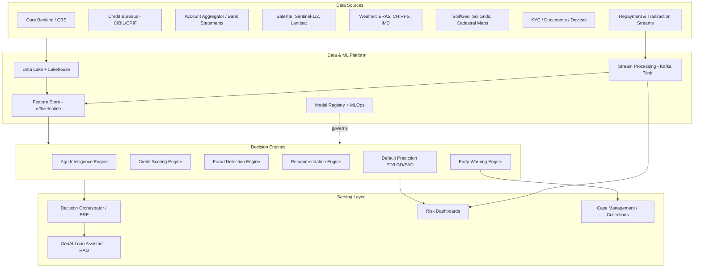

# AI-Powered Smart Lending Decision Hub

## Software Requirements & Algorithm Design Document

| Field | Value |
|---|---|
| Document version | 1.0 |
| Date | 31 August 2026 |
| Status | Draft for review |
| Audience | Bank engineering, data science, risk, compliance, and product teams |
| Scope | Functional requirements + deep algorithm design for every module, with public algorithm/paper references |

---

## Table of Contents

1. [Executive Summary](#1-executive-summary)
2. [System Architecture Overview](#2-system-architecture-overview)
3. [Module 1 — Agricultural Lending Intelligence (Satellite, Weather, Crop & Geo)](#3-module-1--agricultural-lending-intelligence)
4. [Module 2 — AI Credit Scoring Engine](#4-module-2--ai-credit-scoring-engine)
5. [Module 3 — Fraud Detection Engine](#5-module-3--fraud-detection-engine)
6. [Module 4 — Loan Recommendation Engine](#6-module-4--loan-recommendation-engine)
7. [Module 5 — Default Prediction (PD / LGD / EAD)](#7-module-5--default-prediction-pd--lgd--ead)
8. [Module 6 — GenAI Loan Assistant](#8-module-6--genai-loan-assistant)
9. [Module 7 — Real-Time Risk Dashboards](#9-module-7--real-time-risk-dashboards)
10. [Module 8 — Early-Warning System for Defaulters](#10-module-8--early-warning-system-for-defaulters)
11. [Module 9 — User Experience & Interfaces](#11-module-9--user-experience--interfaces)
12. [Cross-Cutting Concerns — MLOps, Model Risk, Fairness, Privacy, Security](#12-cross-cutting-concerns)
13. [Non-Functional Requirements](#13-non-functional-requirements)
14. [Phased Implementation Roadmap](#14-phased-implementation-roadmap)
15. [Consolidated References](#15-consolidated-references)

---

## 1. Executive Summary

The **AI-Powered Smart Lending Decision Hub** is an integrated decisioning platform for a regulated bank that covers the full credit lifecycle:

- **Originate** — AI credit scoring (traditional + alternative data), satellite-driven agricultural underwriting, fraud screening, and a loan recommendation engine that matches each customer to the right product, amount, tenor and price.
- **Serve** — a GenAI loan assistant that answers customer and officer questions, explains decisions, and guides applications.
- **Monitor** — real-time portfolio risk dashboards, continuous default (PD/LGD/EAD) re-estimation, and an early-warning system that flags borrowers likely to default months before they miss a payment.

Design principles used throughout this document:

1. **Champion–challenger, glass-box first.** Every decisioning model has an interpretable baseline (logistic scorecard, Cox model, rules) and a higher-power challenger (gradient boosting, deep learning, GNNs). The bank promotes challengers only when lift is proven and explainability obligations (SHAP-based reason codes) are met.
2. **Every algorithm cited is public.** Each module names the best publicly available algorithm(s), links the originating research paper or reference implementation, explains the mathematics, and describes the refinements needed to run it inside a bank (regulation, latency, data reality in India / emerging markets).
3. **Human-in-the-loop by regulation.** Models recommend; credit policy and (above thresholds) human underwriters decide. This aligns with the RBI Digital Lending Directions (2025), RBI's draft AI/model-risk expectations, the Fed/OCC SR 11-7 model risk framework, and the EU AI Act's classification of credit scoring as high-risk AI.

---

## 2. System Architecture Overview

### 2.1 Logical architecture



### 2.2 Key architectural decisions

| Concern | Decision | Rationale |
|---|---|---|
| Feature consistency | Central **feature store** (e.g., Feast, open source) with offline (training) and online (serving) parity | Eliminates training/serving skew, the #1 cause of silent model degradation |
| Real-time decisions | Event streaming (Apache Kafka) + stream compute (Apache Flink) | Sub-second fraud checks and early-warning triggers on transaction events |
| Decision orchestration | A Business Rules Engine (BRE) wraps all ML scores; policy rules always take precedence | Regulators require policy overridability and audit trails of every decision |
| Model governance | Model registry (MLflow), versioned data (lakehouse), reproducible training pipelines | SR 11-7 / RBI model-risk expectations: every score must be reproducible |
| Explainability | SHAP values computed at score time and stored with the decision | Adverse-action / reason-code duty (ECOA in the US; RBI fair lending & Digital Lending Directions in India) |

### 2.3 Decision flow at origination (agricultural loan example)

1. Application arrives (branch, app, or partner LSP) → KYC + document ingestion.
2. **Fraud engine** screens identity, documents, device, and network graph (Module 3). Hard fail → reject/refer.
3. **Agri intelligence engine** resolves the farm polygon, computes crop, yield, and climate-risk features (Module 1).
4. **Credit scoring engine** produces calibrated PD + reason codes (Module 2).
5. **Recommendation engine** solves for the best product/amount/tenor/price subject to policy and affordability constraints (Module 4).
6. Decision orchestrator applies policy rules; borderline cases route to human underwriters with the full evidence pack (SHAP reasons, satellite time series, fraud flags).
7. Post-disbursal, the loan enters **default-prediction** (Module 5) and **early-warning** (Module 8) monitoring, visible in the **risk dashboards** (Module 7). The **GenAI assistant** (Module 6) serves customers and officers at every step.

---

## 3. Module 1 — Agricultural Lending Intelligence

*(Satellite data, weather, crop and geo-location insights for farm-level underwriting)*

### 3.1 Problem statement

Most smallholder and mid-size farmers have thin or no credit-bureau files, no audited income, and land records of varying quality. The insight from a decade of research and deployments (ICICI/HDFC-style geospatial pilots in India, Apollo Agriculture in Kenya, satellite-credit studies) is that **the farm itself is the balance sheet**: what is grown, how well it grows, how variable yields are across seasons, and how exposed the plot is to drought/flood together predict repayment capacity better than a missing bureau file. Peer-reviewed evidence: satellite-imagery features materially improve rural credit-risk discrimination ([Annals of Operations Research, 2026](https://link.springer.com/article/10.1007/s10479-024-06299-5)); multi-source remote-sensing "digital footprints" predict agricultural loan default ([IJFS/MDPI 2026](https://www.mdpi.com/2227-7072/14/7/187)); WEF documents the Indian geospatial-lending stack ([WEF 2023](https://www.weforum.org/stories/2023/07/how-geospatial-datasets-improve-lending-to-india-farmers/)).

### 3.2 Functional requirements

| ID | Requirement |
|---|---|
| AGR-1 | Resolve a loan application to one or more **farm plot polygons** from GPS pins, survey/khasra numbers, or officer-drawn boundaries; auto-delineate boundaries from imagery when records are absent |
| AGR-2 | Classify **crop type per season** for each plot (multi-year history, ≥ 3 seasons) |
| AGR-3 | Estimate **expected yield and its distribution** per plot per season |
| AGR-4 | Compute **climate/weather risk scores** (drought, excess rain, heat) from historical + forecast data |
| AGR-5 | Convert plot outputs into **farm income estimate + volatility** and a **land-quality index** feeding the credit score (Module 2) |
| AGR-6 | Monitor active loans each satellite revisit (~5 days) for crop failure / non-sowing → feed early-warning (Module 8) |
| AGR-7 | All layers viewable by underwriters on a map UI with time sliders |

### 3.3 Data sources (all public/free unless noted)

| Layer | Source | Resolution / cadence |
|---|---|---|
| Optical imagery | [Sentinel-2 (ESA Copernicus)](https://sentinels.copernicus.eu/web/sentinel/missions/sentinel-2) | 10 m, ~5-day revisit, free |
| Radar (cloud-proof) | Sentinel-1 SAR | 10 m, ~6–12 day, free — critical during monsoon cloud cover |
| Long history | Landsat 8/9, MODIS | 30 m / 250 m, decades of archive |
| Rainfall | [CHIRPS](https://www.chc.ucsb.edu/data/chirps) | 5 km daily, 1981–present |
| Reanalysis weather | [ERA5 (ECMWF)](https://cds.climate.copernicus.eu/datasets/reanalysis-era5-single-levels) | hourly, 1940–present |
| Local weather | IMD gridded data (India) | daily rainfall/temperature |
| Soil | [SoilGrids](https://soilgrids.org) (ISRIC) | 250 m global soil properties |
| Terrain | SRTM / Copernicus DEM | 30 m elevation, slope, drainage |
| Ground truth | State agri dept. crop-cutting experiments, bank's own historical agri NPA outcomes | — |

### 3.4 Algorithms — deep dive

#### 3.4.1 Farm boundary delineation — U-Net family semantic segmentation

**Algorithm.** A **U-Net** encoder–decoder CNN ([Ronneberger et al., 2015, arXiv:1505.04597](https://arxiv.org/abs/1505.04597)) trained on imagery + boundary masks; modern practice fine-tunes the **Segment Anything Model (SAM)** ([Kirillov et al., 2023, arXiv:2304.02643](https://arxiv.org/abs/2304.02643)) for field-boundary extraction, which drastically cuts labeled-data needs.

**How it works.** The encoder downsamples the multispectral image into feature maps; the decoder upsamples them back to pixel resolution with skip connections preserving edge detail. Output: per-pixel probability of "field boundary". Post-processing: watershed segmentation + polygonization (GDAL) → vector plot polygons.

**Bank refinement.**
- Train on peak-of-season Sentinel-2 composites (boundaries are most visible then); use temporal max-NDVI composites to suppress clouds.
- Snap auto-delineated polygons to cadastral/survey layers where digitized land records exist (Bhu-Naksha in many Indian states); flag >20% area mismatch between claimed and observed plot for underwriter review — this is itself a fraud signal ("land inflation").
- Loan officer's mobile app collects a GPS walk-around track as ground truth on a sample; feed back for continual fine-tuning.

#### 3.4.2 Crop-type classification — temporal deep learning on satellite time series

**Algorithm.** Best public approaches classify from the **full seasonal time series** rather than one image, because crops are distinguished by phenology (growth curves), not by a single-date spectrum:

- Baseline: **Random Forest** on time-series statistics of vegetation indices — robust, cheap, interpretable.
- Challenger: **Transformer / temporal-attention networks** on raw band time series — e.g., the transformer & LSTM benchmark of [Rußwurm & Körner, 2020 (arXiv:1901.10681)](https://arxiv.org/abs/1901.10681) on the BreizhCrops dataset ([arXiv:1905.11893](https://arxiv.org/abs/1905.11893)).
- Recommended production model: **Presto**, a lightweight pretrained transformer for remote-sensing pixel time series ([Tseng et al., 2023, arXiv:2304.14065](https://arxiv.org/abs/2304.14065), [code](https://github.com/nasaharvest/presto)) — pretrained self-supervised on global Sentinel-1/2 + weather pixels, then fine-tuned with **hundreds, not millions, of labels**. Ideal for a bank that has few labeled plots. Labeled benchmarks: [CropHarvest](https://github.com/nasaharvest/cropharvest) (Tseng et al., NeurIPS Datasets 2021).

**How it works (Presto).** Each pixel's history is a sequence of tokens: (Sentinel-2 bands, Sentinel-1 VV/VH, NDVI, ERA5 temp/precip, location encoding, month encoding). Masked-autoencoding pretraining (randomly mask timesteps/bands, reconstruct them) teaches the model crop phenology globally. Fine-tuning adds a small head for K-way crop classification. Because Sentinel-1 radar is in the input, it works through monsoon clouds.

**Bank refinement.**
- Class set per agro-climatic zone (e.g., paddy/wheat/sugarcane/cotton/pulses/horticulture/fallow); "fallow/non-sown" is a first-class label because *claimed crop vs observed fallow* is a top agri-fraud and early-warning signal.
- Two-season verification rule: disburse crop loans only after the model confirms sowing of a qualifying crop within the expected sowing window (feeds AGR-6).
- Calibrate per-class probabilities (temperature scaling) and expose "unsure" (< 0.6 confidence) to underwriters instead of forcing a class.

#### 3.4.3 Yield estimation — histogram CNN/LSTM + Deep Gaussian Process

**Algorithm.** The canonical public method is **"Deep Gaussian Process for Crop Yield Prediction Based on Remote Sensing Data"** ([You, Li, Low, Lobell & Ermon, AAAI 2017 — PDF](https://cs.stanford.edu/~ermon/papers/cropyield_AAAI17.pdf), [code](https://github.com/JiaxuanYou/crop_yield_prediction)), extended to data-scarce regions by transfer learning ([Wang et al., COMPASS 2018](https://dl.acm.org/doi/10.1145/3209811.3212707)).

**How it works.**
1. *Dimensionality trick:* instead of feeding raw images, convert each image into **per-band histograms of pixel values** (assuming pixel counts, not positions, carry yield signal). This makes training feasible with small labeled datasets.
2. A **CNN or LSTM** maps the season-long sequence of histograms to a yield estimate.
3. A **Gaussian Process layer** on top of the deep features models spatio-temporal correlation between neighboring districts/years, sharpening predictions and giving **uncertainty intervals** — exactly what a credit model needs (lend on the P25 yield, not the mean).

**Bank refinement.**
- Ground-truth from government crop-cutting experiments (district level) + insurer/PMFBY yield data; downscale to plot level using plot NDVI relative to district NDVI distribution.
- Output **yield distribution** per plot: expected yield, P25, P10. Combine with mandi (market) price distributions to get **revenue-at-risk**.
- Keep a simple, auditable fallback: regression on peak NDVI + rainfall percentile — used when imagery is insufficient and for model validation.

#### 3.4.4 Weather & climate risk — standardized drought indices + extreme-value features

**Algorithm.** Use the meteorological standards rather than reinventing: **SPI** (Standardized Precipitation Index, [McKee et al., 1993](https://climate.colostate.edu/pdfs/relationshipofdroughtfrequency.pdf)) and **SPEI** (Vicente-Serrano et al., 2010, [J. Climate](https://journals.ametsoc.org/view/journals/clim/23/7/2009jcli2909.1.xml), [spei R package](https://spei.csic.es/)) computed from CHIRPS/ERA5.

**How it works.** SPI fits a gamma distribution to the local historical rainfall for a given accumulation window (1/3/6 months) and expresses current rainfall as a z-score; SPEI additionally subtracts potential evapotranspiration, capturing heat-driven drought. Values ≤ −1.5 indicate severe drought.

**Features produced per plot:** drought frequency (fraction of last 20 seasons with SPEI ≤ −1), flood/excess-rain frequency (max 5-day rainfall percentile), heat-stress days during flowering windows per crop, monsoon-onset variability, and irrigation proxy (NDVI persistence through dry spells + proximity to canal/groundwater layers). These become both underwriting features and **portfolio concentration dimensions** (Module 7: "exposure to plots with drought frequency > 30%").

#### 3.4.5 From plots to a credit decision — the Agri Income & Land-Quality Score

Deterministic, auditable aggregation (kept out of ML deliberately, so credit policy owns it):

```
ExpectedIncome = Σ_plots Σ_seasons  Area × Yield_P50 × Price_P50 − InputCosts
StressedIncome = Σ_plots Σ_seasons  Area × Yield_P25 × Price_P25 − InputCosts
LandQualityIndex = f(soil organic carbon, slope, irrigation proxy,
                     5-yr mean peak NDVI percentile vs. agro-zone,
                     yield volatility, drought frequency)
Affordability   = StressedIncome − ExistingObligations (bureau + AA data)
```

`ExpectedIncome`, `StressedIncome`, `LandQualityIndex`, yield volatility, and climate-risk features are passed to Module 2 as first-class features; `Affordability` caps the recommended amount in Module 4.

### 3.5 Implementation notes

- **Stack:** Python; `sentinelhub`/Copernicus Data Space or Google Earth Engine for imagery; `rasterio`, `geopandas`, GDAL; PyTorch for Presto/U-Net; PostGIS for polygon storage; tile server (titiler) for the underwriter map UI.
- **Cost control:** all imagery listed is free; compute cost is dominated by one-time backfill. Cache per-plot feature time series in the feature store; recompute only on new revisits.
- **Validation:** backtest on the bank's historical agri portfolio — verify that LandQualityIndex quartiles monotonically order historical NPA rates before allowing the features into production scoring.

---

## 4. Module 2 — AI Credit Scoring Engine

### 4.1 Problem statement

Produce, for every applicant (salaried, self-employed, MSME, farmer), a **calibrated probability of default (PD)** over a defined horizon (typically 12 months / "ever 90+ DPD in 12 months"), with regulator-grade explainability, using bureau data where available and alternative data (bank statements via Account Aggregator, telco/behavioral with consent, agri features from Module 1) where it is not.

### 4.2 Functional requirements

| ID | Requirement |
|---|---|
| CS-1 | Score any applicant in < 500 ms (online) with the exact same features as training (feature-store parity) |
| CS-2 | Output: calibrated PD, score (e.g., 300–900 scale), top-5 reason codes, confidence/coverage flag |
| CS-3 | Segment-specific models: bureau-thick, bureau-thin/new-to-credit, MSME, agri |
| CS-4 | Champion (scorecard) and challenger (GBM) run in parallel; champion decisions logged for challenger comparison |
| CS-5 | Reject inference performed at each retrain to correct selection bias |
| CS-6 | Fairness metrics computed per protected/proxy group each month; drift (PSI/CSI) monitored weekly |
| CS-7 | Every production score reproducible from versioned model + versioned features for ≥ 8 years |

### 4.3 Algorithms — deep dive

#### 4.3.1 Baseline champion — WOE-binned Logistic Regression Scorecard

**Why it exists.** The industry-standard scorecard (Siddiqi, *Credit Risk Scorecards*, Wiley; survey: [Hand & Henley, 1997, JRSS-A](https://www.jstor.org/stable/2983268)) remains the champion in most regulated banks because it is monotonic, point-based, trivially explainable, and stable.

**How it works.**
1. **Binning:** each variable is split into bins (monotone optimal binning, e.g. the open-source [OptBinning](https://github.com/guillermo-navas-palencia/optbinning) solver, which formulates binning as a mixed-integer program maximizing IV subject to monotonicity).
2. **Weight of Evidence:** `WOE_bin = ln( %Goods_bin / %Bads_bin )`. **Information Value** `IV = Σ (%Goods−%Bads)·WOE` ranks variables (keep IV ∈ [0.02, 0.5]; above 0.5 → leakage suspicion).
3. **Logistic regression** on WOE-transformed variables: `log(p/(1−p)) = β₀ + Σ βᵢ·WOE(xᵢ)`.
4. **Score scaling:** points = offset − factor·log-odds, e.g. 20 points to double the odds (PDO=20).

**Reason codes** are free: the bins with the largest negative point contributions are the adverse-action reasons.

#### 4.3.2 Challenger — Gradient-Boosted Decision Trees (XGBoost / LightGBM)

**Why.** The largest public benchmark of classifiers for credit scoring — [Lessmann, Baesens, Seow & Thomas, 2015, *EJOR*: "Benchmarking state-of-the-art classification algorithms for credit scoring: An update of research"](https://www.sciencedirect.com/science/article/abs/pii/S0377221715004208) — and every major Kaggle credit competition since (Home Credit Default Risk, American Express Default) find **gradient-boosted tree ensembles** the strongest tabular learners, typically +2–6 Gini points over logistic scorecards. Deep tabular models (TabNet, [arXiv:1908.07442](https://arxiv.org/abs/1908.07442); FT-Transformer) rarely beat tuned GBMs on credit tabular data.

**Algorithms & papers:**
- **XGBoost** — [Chen & Guestrin, KDD 2016, arXiv:1603.02754](https://arxiv.org/abs/1603.02754)
- **LightGBM** — [Ke et al., NeurIPS 2017](https://papers.nips.cc/paper/2017/hash/6449f44a102fde848669bdd9eb6b76fa-Abstract.html) (histogram-based splits + GOSS sampling; fastest at bank scale)
- **CatBoost** — [Prokhorenkova et al., NeurIPS 2018, arXiv:1706.09516](https://arxiv.org/abs/1706.09516) (ordered target statistics for high-cardinality categoricals like occupation, pincode)

**How gradient boosting works (concise math).** The model is an additive ensemble `F_M(x) = Σ_m η·f_m(x)` of depth-limited regression trees. Each tree is fit to the negative gradient of the loss (log-loss for PD). XGBoost's innovation is a second-order Taylor expansion of the loss: for a fixed tree structure with leaf sets `I_j`, the optimal leaf value is `w*_j = −Σg_i / (Σh_i + λ)` and the split gain is
`Gain = ½ [ G_L²/(H_L+λ) + G_R²/(H_R+λ) − (G_L+G_R)²/(H_L+H_R+λ) ] − γ`,
where `g,h` are the first/second derivatives of the loss. This regularized gain (`λ`, `γ`, plus `min_child_weight`, subsampling, learning rate) is what makes it robust on noisy credit data.

**Bank refinements (the difference between a Kaggle model and a bank model):**
1. **Monotonic constraints.** XGBoost/LightGBM support `monotone_constraints`: force PD to be non-increasing in income, non-decreasing in DPD history, utilization, enquiries. This closes most of the regulator's "counter-intuitive behavior" objections at a cost of <0.5 Gini.
2. **Calibration.** Raw GBM outputs are not calibrated probabilities. Fit **isotonic regression** or **Platt scaling** on a held-out calibration set ([Niculescu-Mizil & Caruana, ICML 2005](https://www.cs.cornell.edu/~alexn/papers/calibration.icml05.crc.rev3.pdf)); validate with reliability diagrams + Brier score. PDs feed pricing and IFRS-9/ECL, so calibration is not optional.
3. **Explainability — SHAP.** [Lundberg & Lee, NeurIPS 2017, arXiv:1705.07874](https://arxiv.org/abs/1705.07874) and the polynomial-time **TreeSHAP** algorithm ([Lundberg et al., 2020, Nature MI, arXiv:1905.04610](https://arxiv.org/abs/1905.04610)). SHAP values φᵢ are the unique attribution satisfying local accuracy (Σφᵢ = f(x) − E[f]), consistency, and missingness (Shapley axioms). Per-decision top negative SHAP features → adverse-action reason codes; global SHAP summaries → model documentation.
4. **Reject inference.** Training only on approved loans biases the model. Standard corrections (surveyed in [Crook & Banasik, 2004; overview in Lessmann et al. 2015](https://www.sciencedirect.com/science/article/abs/pii/S0377221715004208)): parceling / fuzzy augmentation (assign rejected applicants weighted good/bad outcomes from the current model), or better, **bureau-based inference** — observe how the bank's rejects performed on loans they got elsewhere (bureau retro data). Run at every retrain; document uplift.
5. **Thin-file / alternative data segment.** For new-to-credit customers, add: Account-Aggregator bank-statement features (income regularity, balance volatility, bounce counts), agri features (Module 1), and — with explicit consent and regulatory clearance — behavioral/telco features, whose predictive power is established in [Björkegren & Grissen, "Behavior Revealed in Mobile Phone Usage Predicts Credit Repayment," World Bank Economic Review 2020 / arXiv:1712.05840](https://arxiv.org/abs/1712.05840). Psychometric scoring (EFL/LenddoEFL line of work) is an optional add-on for zero-file MSME.

#### 4.3.3 Fairness constraints

Compute **demographic parity difference, equalized-odds difference** ([Hardt, Price & Srebro, NeurIPS 2016, arXiv:1610.02413](https://arxiv.org/abs/1610.02413)) and **adverse-impact ratio** on gender, age bands, and geography (caste/religion are never features; test pincode as a proxy). Mitigation ladder: remove/neutralize offending features → in-processing reduction ([Agarwal et al., ICML 2018, arXiv:1803.02453](https://arxiv.org/abs/1803.02453), implemented in [Fairlearn](https://fairlearn.org)) → threshold adjustment. Document trade-offs in the model card.

#### 4.3.4 Evaluation & monitoring metrics

- **Discrimination:** AUC/Gini, KS statistic, Gini by segment and vintage.
- **Calibration:** Brier score, Hosmer–Lemeshow by decile, ECE.
- **Stability:** PSI (Population Stability Index) `PSI = Σ (aᵢ−eᵢ)·ln(aᵢ/eᵢ)` on score and each feature (CSI); alert > 0.1, act > 0.25.
- **Business:** approval rate, bad rate by score band, swap-set analysis champion vs challenger, profit curves.

### 4.4 Implementation notes

- Stack: Python, LightGBM/XGBoost, OptBinning, scikit-learn (calibration), SHAP, Fairlearn, MLflow registry, Feast feature store; ONNX or native model server for <500 ms serving.
- Target definition workshop with risk (default = 90+ DPD within 12 months of disbursal is standard; verify against IFRS-9 default definition for consistency with Module 5).
- Sample-size guidance: scorecard stable from ~1,500 bads; GBM benefits up to millions of rows; use 5-fold time-based (out-of-time) validation, never random splits.

---

## 5. Module 3 — Fraud Detection Engine

### 5.1 Problem statement

Detect, at application time and post-disbursal, the major lending-fraud typologies: **identity fraud** (stolen/synthetic identities), **document fraud** (forged salary slips, bank statements, land records), **collusive/agent fraud** (rings of applications sharing devices, addresses, references, or middlemen), **asset/land inflation** (agri: claimed acreage or crop that isn't there), and **first-party fraud** (borrowing with no intent to repay). Fraud is adversarial and rare (<<1%), so the engine must combine rules, supervised learning, unsupervised anomaly detection, and graph analytics.

### 5.2 Functional requirements

| ID | Requirement |
|---|---|
| FR-1 | Real-time (< 300 ms) application-time risk score combining rules + models; three outcomes: pass / step-up verification / refer to fraud desk |
| FR-2 | Entity resolution across applications: fuzzy match on name/address/phone/device/bank account/documents |
| FR-3 | Graph construction and ring detection over shared attributes; nightly full-graph refresh, streaming incremental updates |
| FR-4 | Document forensics on uploaded PDFs/images (tamper detection + cross-field consistency) |
| FR-5 | Feedback loop: confirmed fraud cases from the fraud desk retrain models monthly; every alert dispositioned |
| FR-6 | Agri cross-check: claimed land/crop vs Module 1 observations (area mismatch, fallow-when-claimed-sown) |

### 5.3 Algorithms — deep dive

#### 5.3.1 Layer 1 — Supervised risk scoring (GBM)

Same LightGBM/XGBoost machinery as Module 2, but trained on **confirmed fraud labels** with extreme class imbalance. Techniques: class weighting or focal loss; evaluate with **AUC-PR and recall@fixed-alert-budget** (e.g., recall at 0.5% alert rate), never accuracy. Features: velocity counters from the stream layer (applications per device/phone/address in 1h/24h/7d — computed in Flink), KYC mismatch distances, bureau footprint anomalies (new file + many enquiries = synthetic identity signature), geolocation vs claimed address distance.

#### 5.3.2 Layer 2 — Unsupervised anomaly detection (Isolation Forest + Autoencoder)

Fraud labels are incomplete; unsupervised layers catch novel patterns.

- **Isolation Forest** — [Liu, Ting & Zhou, ICDM 2008](https://cs.nju.edu.cn/zhouzh/zhouzh.files/publication/icdm08b.pdf). Random trees isolate points; anomalies have short average path length `E[h(x)]`; score `s(x)=2^{−E[h(x)]/c(n)}`. Linear time, works untuned — the default first anomaly layer.
- **Deep autoencoder** reconstruction error on application-feature vectors for non-linear structure; threshold at a fixed alert budget.
- Both scores enter the Layer-1 GBM as features (semi-supervised stacking) rather than alerting independently — this keeps one tunable alert queue.

#### 5.3.3 Layer 3 — Graph-based ring detection (the highest-value layer for lending fraud)

**Graph construction.** Nodes: applicants, devices, phone numbers, addresses (geocoded + normalized), bank accounts, employers, references, agents/DSAs, documents (perceptual hash). Edges: shared-attribute links. Store in a graph DB (Neo4j / TigerGraph) or as edge lists for batch GNN training.

**Algorithms, in increasing sophistication:**
1. **Connected components + rule mining**: components with > k applications in a window, or an agent node with abnormal fan-out, are classic bust-out ring signatures. Cheap, explainable — deploy first.
2. **Community detection — Louvain** ([Blondel et al., 2008, arXiv:0803.0476](https://arxiv.org/abs/0803.0476)) to find dense clusters; score clusters by fraud-label density and shared-attribute entropy.
3. **GNN node classification — GraphSAGE** ([Hamilton, Ying & Leskovec, NeurIPS 2017, arXiv:1706.02216](https://arxiv.org/abs/1706.02216)): inductive neighborhood aggregation `h_v = σ(W·AGG({h_u}) )` so *new* applications are scorable without retraining — essential for real-time.
4. **Fraud-specialized GNN — CARE-GNN** ([Dou et al., CIKM 2020, arXiv:2008.08692](https://arxiv.org/abs/2008.08692)): fraudsters **camouflage** by connecting to many legitimate nodes; CARE-GNN learns, via reinforcement-learned neighbor filtering, to select only label-informative neighbors per relation before aggregating. This is the right published architecture for adversarial lending graphs. Survey of the field: [GNNs for Financial Fraud Detection: A Review, arXiv:2411.05815](https://arxiv.org/abs/2411.05815). Public benchmark for money-flow graphs: the **Elliptic** Bitcoin AML dataset & GCN baseline ([Weber et al., 2019, arXiv:1908.02591](https://arxiv.org/abs/1908.02591)).

**Bank refinement:** run GraphSAGE/CARE-GNN nightly to produce a per-node **graph risk score** cached in the feature store; real-time scoring reads the cached score of matched entities plus fast 1-hop features (neighbor fraud count). Alerts always ship with the subgraph visualization for the fraud desk — a GNN alert without the picture will not be actioned.

#### 5.3.4 Layer 4 — Document forensics

- **Tamper detection:** Error Level Analysis + copy-move forgery detection; deep splice detectors such as **Noiseprint** ([Cozzolino & Verdoliva, 2018, arXiv:1808.08396](https://arxiv.org/abs/1808.08396)) which learns a camera-model fingerprint; inconsistencies localize edits (pasted salary figures).
- **Cross-field consistency:** OCR (Tesseract / docTR) → parse salary slips & bank statements → recompute totals, verify EPF/TDS arithmetic, match statement closing balances across months, verify IFSC/branch validity, and reconcile against Account-Aggregator data when the customer consents (AA data is fetched from the bank directly and is therefore unforgeable — prefer it and treat "customer refuses AA but uploads PDF" as a risk signal).
- **Template fingerprinting:** perceptual hash (pHash) of document layout; the same forged template reused across applicants creates document–document edges in the Layer-3 graph.

#### 5.3.5 Agri-specific fraud checks (from Module 1)

Deterministic rules: claimed area > polygon area × 1.2 → refer; claimed crop ≠ classified crop for 2 consecutive revisits → refer; same polygon pledged across > 1 active application (spatial index overlap query) → hard stop ("double-pledging"); NDVI time series identical to a neighboring application's plot (copy-pasted coordinates) → refer.

### 5.4 Evaluation

Precision/recall at the operating alert budget, value-detection rate (₹ of fraud caught / ₹ attempted), time-to-detection, and **false-positive customer friction** (step-up rate on good customers < 3%). A/B against the incumbent rules engine before decommissioning any rule.

---

## 6. Module 4 — Loan Recommendation Engine

### 6.1 Problem statement

Given an approved (or approvable) customer, choose the **product, amount, tenor, and price** that maximizes long-run risk-adjusted profit **and** customer suitability, subject to hard constraints: affordability (FOIR/DSCR caps), policy limits, RBI fair-practice pricing norms, and portfolio concentration limits. This is *not* a Netflix-style recommender — the objective is constrained decisioning with a learning layer, and "suitability" is a regulatory duty, not a nicety.

### 6.2 Functional requirements

| ID | Requirement |
|---|---|
| RE-1 | For each eligible customer, produce a ranked set of ≤ 3 offers (product, amount, tenor, rate) with an explanation |
| RE-2 | Hard-constraint filter runs before any ML: affordability (stressed income from Modules 1–2), LTV, policy, KYC tier, concentration caps |
| RE-3 | Risk-based pricing from calibrated PD/LGD (Module 2/5) with floor/ceiling rates from ALM/policy |
| RE-4 | Learning loop: offer take-up and subsequent performance feed back to improve targeting (bandit layer) |
| RE-5 | Cross-sell triggers (e.g., harvest-cycle top-ups, working-capital renewal) generated from lifecycle events |
| RE-6 | Full decision log: constraints evaluated, candidates considered, chosen offer, model versions |

### 6.3 Algorithms — deep dive

#### 6.3.1 Stage 1 — Feasible-set generation (deterministic optimization)

For each candidate (product, amount, tenor, rate) grid point:

```
EMI(a, r, n) = a·r(1+r)^n / ((1+r)^n − 1)
Feasible iff: EMI + existing obligations ≤ FOIR_cap × VerifiedIncome   (retail)
              DSCR = CashFlow/DebtService ≥ 1.25                        (MSME/agri, on StressedIncome)
              a ≤ LTV_cap × CollateralValue ; tenor ≤ product max ; etc.
```

**Risk-based price:** `rate = cost_of_funds + opex + E[loss] + capital_charge + margin`, where `E[loss] = PD_calibrated × LGD × EAD` (Modules 2/5) — the standard risk-based pricing decomposition (see [Phillips, *Pricing Credit Products*, Stanford Univ. Press, 2018](https://www.sup.org/books/business/pricing-credit-products)). Expected profit per candidate: `E[π] = interest+fees − funding − opex − PD·LGD·EAD − capital·hurdle`.

#### 6.3.2 Stage 2 — Take-up / response modeling

A LightGBM propensity model `P(accept | customer, offer)` trained on historical offer logs. Combine: `E[value] = P(accept)·E[π | accept]`. Guard against the feedback loop (the model only sees offers previously made) with the bandit layer below and periodic randomized exploration cells (1–2% of eligible traffic, approved by policy, within feasible set only).

#### 6.3.3 Stage 3 — Contextual bandit for offer selection (the learning core)

**Algorithm.** **LinUCB** — [Li, Chu, Langford & Schapire, WWW 2010, "A Contextual-Bandit Approach to Personalized News Article Recommendation," arXiv:1003.0146](https://arxiv.org/abs/1003.0146); production alternative **Thompson Sampling** ([Chapelle & Li, NeurIPS 2011](https://papers.nips.cc/paper/2011/hash/e53a0a2978c28872a4505bdb51db06dc-Abstract.html); tutorial [Russo et al., arXiv:1707.02038](https://arxiv.org/abs/1707.02038)).

**How LinUCB works.** Each arm (offer template) a has parameters θ_a; expected reward is linear in context x (customer features): `E[r|x,a] = x^T θ_a`. Ridge estimate `θ̂_a = A_a^{-1} b_a` with `A_a = D^T D + I`, `b_a = D^T r`. Choose the arm maximizing the **upper confidence bound** `x^T θ̂_a + α √(x^T A_a^{-1} x)` — the second term is the exploration bonus, large when the arm is under-observed for this context type. Regret is provably `Õ(√T)`.

**Bank refinement.**
- Bandit chooses only **among the feasible set** from Stage 1 — exploration can never breach affordability or policy. Reward = short-term take-up blended with a long-term risk-adjusted value proxy (updated as the loan seasons); use delayed-reward correction.
- Arms are offer *templates* (e.g., "amount = 80% of max, tenor 36m, rate = base+50bp"), not raw grid points, keeping the arm space small and auditable.
- Log **propensities** for every decision to allow off-policy evaluation (doubly-robust estimators; [Dudík, Langford & Li, ICML 2011, arXiv:1103.4601](https://arxiv.org/abs/1103.4601)) so future policies can be evaluated without new experiments.

#### 6.3.4 Stage 4 — Cross-sell / next-best-product with uplift modeling

Target customers whose behavior *changes because of* the offer, not those who would borrow anyway. **Uplift modeling** estimates `τ(x) = E[Y|treat,x] − E[Y|control,x]`: meta-learners (T/S/X-learner — [Künzel et al., PNAS 2019, arXiv:1706.03461](https://arxiv.org/abs/1706.03461)) or **causal forests** ([Wager & Athey, JASA 2018, arXiv:1510.04342](https://arxiv.org/abs/1510.04342)); open-source: [CausalML (Uber)](https://github.com/uber/causalml), [EconML (Microsoft)](https://github.com/py-why/EconML). Evaluate with Qini curves. Requires maintaining small randomized holdouts on campaigns — make that a standing policy.

Agri lifecycle triggers are rule-based and calendar-driven from Module 1: sowing confirmed → input-cost top-up eligibility; harvest window + good NDVI season → equipment-loan campaign; drought flag → *suppress* marketing, offer restructuring instead (suitability duty).

### 6.4 Evaluation

Take-up rate, approval-to-disbursal conversion, 12-month vintage bad rate of recommended vs. control offers, uplift Qini coefficient, and suitability audit samples (human review that recommended EMIs respect stressed affordability).

---

## 7. Module 5 — Default Prediction (PD / LGD / EAD)

### 7.1 Problem statement

Beyond the point-in-time application score (Module 2), the bank needs **through-the-cycle and lifetime risk quantities on the live book**: behavioral PD that updates monthly (or on-event), **time-to-default** estimates, LGD and EAD — because these drive IFRS-9/Ind AS 109 expected-credit-loss provisioning, Basel IRB capital (if applicable), collections prioritization, and the dashboards in Module 7.

### 7.2 Functional requirements

| ID | Requirement |
|---|---|
| DP-1 | Behavioral PD for every live account, refreshed monthly + on trigger events (missed EMI, bureau alert, agri distress flag) |
| DP-2 | Survival curve S(t) per account → PD(12m), lifetime PD, expected time-to-default |
| DP-3 | LGD model with downturn adjustment; EAD/CCF for revolving products (KCC, OD, credit lines) |
| DP-4 | IFRS-9 staging engine: Stage 1/2/3 assignment with significant-increase-in-credit-risk (SICR) rules using PD deterioration |
| DP-5 | Macro-conditioning: PD/LGD adjustable under baseline/adverse scenarios for stress testing |
| DP-6 | Backtesting suite: calibration by grade and vintage, migration-matrix stability |

### 7.3 Algorithms — deep dive

#### 7.3.1 Behavioral PD — GBM on performance features

Same LightGBM machinery as Module 2 but on **behavioral features**: DPD trajectory (max DPD 3/6/12m, times-in-arrears), utilization trend, payment-to-minimum ratios, bounce counts, bureau enquiries since disbursal, deposit-account cash-flow features, and (agri) current-season NDVI/SPEI status from Module 1. Behavioral scores dominate application scores ~6 months into the loan; this is standard behavioral-scoring practice (Thomas, Crook & Edelman, *Credit Scoring and Its Applications*, SIAM, 2nd ed. 2017).

#### 7.3.2 Time-to-default — survival analysis (the methodologically correct frame)

Classification ("will default in 12m?") throws away *when* and mishandles censoring (loans that prepaid or are young). Survival analysis fixes both — established for credit by [Narain (1992)] and benchmarked in [Dirick, Claeskens & Baesens, "Time to default in credit scoring using survival analysis: a benchmark study," JORS 2017 — PDF](https://d-nb.info/1122167008/34).

**a) Cox Proportional Hazards** (baseline, interpretable) — Cox, 1972, JRSS-B. Hazard `λ(t|x) = λ₀(t)·exp(βᵀx)`; β estimated by partial likelihood without specifying λ₀. Outputs hazard ratios auditors understand. Extend with time-varying covariates (each month's behavioral features enter as updated x_t) — this is the production formulation.

**b) DeepSurv** (challenger) — [Katzman et al., "DeepSurv: personalized treatment recommender system using a Cox proportional hazards deep neural network," BMC Medical Research Methodology 2018, arXiv:1606.00931](https://arxiv.org/abs/1606.00931). Replaces βᵀx with a neural network h_ψ(x) trained on the Cox partial-likelihood loss; captures interactions (e.g., utilization × income volatility) while keeping the survival structure.

**c) Gradient-boosted survival / discrete-time hazard** (recommended production challenger): recast as discrete-time hazard — one row per account-month, target = default in that month, with monotone-constrained LightGBM and month dummies for the baseline hazard. This gets GBM accuracy, full censoring correctness, easy time-varying covariates, and standard tooling ([scikit-survival](https://github.com/sebp/scikit-survival) for Cox/RSF variants; discrete-time approach surveyed in [Tutz & Schmid, *Modeling Discrete Time-to-Event Data*, Springer 2016](https://link.springer.com/book/10.1007/978-3-319-28158-2)).

**d) Competing risks.** Prepayment competes with default (a prepaid loan can't default). Use the **Fine–Gray subdistribution hazard** ([Fine & Gray, JASA 1999](https://www.tandfonline.com/doi/abs/10.1080/01621459.1999.10474144)) or cause-specific discrete-time hazards with a multinomial target {perform, prepay, default} — important for pricing and for not over-predicting risk on fast-prepaying segments.

**Metrics:** Harrell's C-index (discrimination over time), time-dependent AUC, integrated Brier score, calibration of S(12m) by decile.

#### 7.3.3 LGD and EAD

- **LGD**: two-stage model — (1) cure probability (logistic/GBM: defaulted account returns to performing), (2) recovery rate on non-cured, using **beta regression** ([Ferrari & Cribari-Neto, 2004](https://www.tandfonline.com/doi/abs/10.1081/STA-120037418)) or GBM on [0,1] with workout-LGD targets discounted to default date. Key drivers: collateral type & LTV, seasoning, geography, legal-recovery timeline (SARFAESI applicability), and for agri, land quality (Module 1). Benchmark literature: [Loterman et al., "Benchmarking regression algorithms for loss given default modeling," IJF 2012](https://www.sciencedirect.com/science/article/abs/pii/S0169207011000586).
- **EAD**: for term loans EAD ≈ amortized balance; for revolvers estimate the **credit conversion factor** `CCF = (EAD − B₀)/(L − B₀)` via GBM/tobit on limit, utilization, and behavior ([Moral, in *The Basel II Risk Parameters*, Springer 2011](https://link.springer.com/chapter/10.1007/978-3-642-16114-8_10)).

#### 7.3.4 IFRS-9 staging & macro conditioning

- **SICR/Stage-2 rule**: relative lifetime-PD deterioration (e.g., lifetime PD > 2× at origination) OR 30+ DPD backstop OR early-warning red flag (Module 8). Stage 3 = credit-impaired/90+ DPD.
- **Macro linkage**: satellite/weather aggregates are *leading* macro factors for the agri book (district SPEI, monsoon deviation) — regress segment default rates on macro factors (Wilson-style models: [Wilson, "Portfolio Credit Risk," FRBNY Economic Policy Review 1998](https://www.newyorkfed.org/research/epr/98v04n3/9810wils.html)) and shift PDs under RBI/ICAAP scenarios.

---

## 8. Module 6 — GenAI Loan Assistant

### 8.1 Problem statement

A conversational assistant with two faces: (a) **customer-facing** — explains products, eligibility, required documents, EMI math, application status, and decision reasons in the customer's language (Hindi/English + regional); (b) **officer-facing** — retrieves policy, summarizes an application file (bureau report + statements + satellite evidence), and drafts credit notes. It must **never** itself decide credit outcomes, never hallucinate rates/policy, and must comply with RBI Digital Lending disclosure norms (rates and fees quoted only from the sanctioned Key Fact Statement).

### 8.2 Functional requirements

| ID | Requirement |
|---|---|
| GA-1 | Grounded Q&A over the bank's product policies, FAQs, rate sheets, and regulations via retrieval (no free recall of numbers) |
| GA-2 | Tool/function calling into core systems: application status, EMI calculator, document checklist, appointment booking — all read-only or workflow-safe |
| GA-3 | Decision explanation: render Module-2 reason codes into plain-language, compliant explanations (templated, not free-generated) |
| GA-4 | Multilingual (≥ Hindi + English + 2 regional), with automatic language detection |
| GA-5 | Guardrails: PII redaction, prompt-injection defense, toxicity/advice filters, refusal on out-of-scope (investment advice etc.); human handoff path |
| GA-6 | Full conversation logging, hallucination audit sampling (≥ 2% of sessions weekly), and answer-with-citation (every factual claim links its source passage) |

### 8.3 Algorithms — deep dive

#### 8.3.1 Retrieval-Augmented Generation (RAG)

**Paper:** [Lewis et al., "Retrieval-Augmented Generation for Knowledge-Intensive NLP Tasks," NeurIPS 2020, arXiv:2005.11401](https://arxiv.org/abs/2005.11401).

**Production pipeline:**
1. **Corpus**: product policy docs, rate circulars, KFS templates, RBI FAQs — chunked (300–800 tokens, structure-aware: keep tables intact), each chunk tagged with product, effective date, and version. **Stale-rate poisoning is the #1 RAG failure in banks** — retrieval must filter to currently-effective documents.
2. **Hybrid retrieval**: dense embeddings (any strong open embedding model) + **BM25** ([Robertson & Zaragoza, 2009](https://www.staff.city.ac.uk/~sbrp622/papers/foundations_bm25_review.pdf)) merged with reciprocal-rank fusion, then a **cross-encoder reranker**. Hybrid matters because banking queries are full of exact tokens (product codes, "KCC", "MCLR") that dense retrieval alone fumbles.
3. **Generation with citation**: the LLM answers *only* from retrieved passages; system prompt forbids uncited numeric claims; the UI renders passage citations.
4. **Faithfulness check**: an automatic entailment/groundedness scorer on each answer (e.g., the RAGAS framework, [arXiv:2309.15217](https://arxiv.org/abs/2309.15217)); low-faithfulness answers are suppressed → fallback to "let me connect you to an officer".

#### 8.3.2 Tool use / function calling

Standard function-calling (ReAct-style reasoning–acting loop: [Yao et al., ICLR 2023, arXiv:2210.03629](https://arxiv.org/abs/2210.03629)) against a **strict allow-listed API schema**: `get_application_status(id)`, `compute_emi(p, r, n)`, `get_document_checklist(product)`, `book_branch_slot(...)`. Numeric answers (EMI, eligibility amounts) are always computed by tools, never generated — LLM arithmetic is not audit-safe.

#### 8.3.3 Guardrails & safety

- **Programmable rails:** [NeMo Guardrails, arXiv:2310.10501](https://arxiv.org/abs/2310.10501) or equivalent policy layer: topic fences (no investment/tax advice, no negotiation of rates), jailbreak/prompt-injection filters on both user input and retrieved content, PII redaction before logging.
- **Injection defense:** treat retrieved documents and user uploads as untrusted; instruction/data separation in prompts; deny tool calls not on the allow-list; per-session rate limits. (Survey: [Greshake et al., "Not what you've signed up for: Compromising Real-World LLM-Integrated Applications with Indirect Prompt Injection," 2023, arXiv:2302.12173](https://arxiv.org/abs/2302.12173).)
- **Decision explanations are templated**: Module 2's reason codes map to pre-approved plain-language sentences (legal-vetted, per language). The LLM may only *select and order* templates, not compose new adverse-action language.

#### 8.3.4 Evaluation

Groundedness/faithfulness score distribution, retrieval hit-rate@k on a curated Q&A golden set (≥ 500 questions, refreshed quarterly), containment rate (sessions resolved without human), escalation correctness, and red-team suites run on every model or prompt change.

---

## 9. Module 7 — Real-Time Risk Dashboards

### 9.1 Problem statement

Give risk officers, business heads, and the CRO a **live, drillable view** of portfolio health: exposures, expected loss, vintage curves, concentration (geography, crop, sector, agent), model health (drift, calibration), fraud alert queues, and early-warning heatmaps — computed from streaming events, not last month's batch.

### 9.2 Functional requirements

| ID | Requirement |
|---|---|
| RD-1 | Streaming ingestion of disbursals, repayments, DPD transitions, fraud alerts, EWS flags; dashboard freshness ≤ 5 min |
| RD-2 | Portfolio metrics: EAD, expected loss (Σ PD·LGD·EAD), NPA/DPD buckets, roll rates, vintage curves by cohort |
| RD-3 | Concentration views: geographic (district/agro-zone maps), crop, product, channel/agent; limit-utilization alerts |
| RD-4 | Agri overlay: district-level SPEI/NDVI anomalies joined to exposure (Module 1) — "monsoon risk map of the book" |
| RD-5 | Model-health panel: PSI/CSI per model, calibration drift, alert volumes, champion–challenger deltas |
| RD-6 | Scenario widget: shift macro/weather factors → re-computed expected loss (Module 5 macro models) |
| RD-7 | Role-based access; every figure exportable with data lineage |

### 9.3 Algorithms & methods — deep dive

#### 9.3.1 Streaming computation

- **Event backbone:** Apache Kafka topics per event type; **Apache Flink** for windowed aggregations (DPD roll-rate counters, velocity features shared with Module 3) — Flink's event-time watermarks handle late repayment postings correctly ([Carbone et al., "Apache Flink: Stream and Batch Processing in a Single Engine," IEEE Data Eng. Bulletin 2015](http://sites.computer.org/debull/A15dec/p28.pdf)).
- **Serving:** streaming aggregates land in a low-latency OLAP store (Apache Druid / ClickHouse / Pinot) behind a BI layer (Superset/Grafana or the bank's tool).

#### 9.3.2 Roll rates & transition matrices

Monthly **Markov transition matrix** across DPD buckets {current, 1–30, 31–60, 61–90, 90+, closed}; estimate `P̂ᵢⱼ = nᵢⱼ/nᵢ` per segment; flag statistically significant deterioration vs trailing 12-month baseline (chi-square / CUSUM on the 30→60 and 60→90 cells — the earliest portfolio-level warning). Forward-multiply matrices for short-horizon NPA forecasts.

#### 9.3.3 Model drift monitoring

- **PSI/CSI** on scores and features (Module 2 formulas), computed by Flink jobs weekly.
- **ADWIN** adaptive windowing for streaming concept-drift detection on model inputs and outcome rates ([Bifet & Gavaldà, SDM 2007](https://www.cs.upc.edu/~gavalda/papers/adwin06.pdf)) — detects change points without fixed window tuning; open-source in [River](https://github.com/online-ml/river).
- Calibration drift: rolling Brier/observed-vs-expected default by score band with CUSUM control charts.

#### 9.3.4 Anomaly surfacing on dashboards

Time-series anomaly detection on operational metrics (application volumes per channel, approval rates, alert rates) using seasonal decomposition + robust z-scores (e.g., Seasonal-Hybrid ESD, [Hochenbaum, Vallis & Kejariwal, 2017, arXiv:1704.07706](https://arxiv.org/abs/1704.07706)) so that pipeline breaks or agent-level manipulation (a DSA suddenly at 100% approval) surface without anyone writing a bespoke alert.

Visualization guidance: risk maps use district choropleths of exposure × hazard; vintage curves are cohort lines (months-on-book vs cumulative bad rate); every red number links to the account-level list behind it (drill-through is what makes a dashboard a tool rather than a poster).

---

## 10. Module 8 — Early-Warning System for Defaulters

### 10.1 Problem statement

Identify borrowers **30–120 days before first serious delinquency**, so the bank can intervene cheaply (reminder, restructuring, top-up denial, field visit) rather than collect expensively. An EWS differs from Module 5: it is **event-driven, high-recall, account-level, and action-oriented**, fusing transactional behavior, bureau alerts, and (for agri) satellite distress signals. Literature: systematic review of financial EWS ([arXiv:2310.00490](https://arxiv.org/pdf/2310.00490)); real-time digital-signal EWS ([arXiv:2510.22287](https://arxiv.org/abs/2510.22287)); RBI's own EWS mandate for fraud/NPA monitoring in its Master Directions on Frauds makes this module a compliance item, not just a nice-to-have.

### 10.2 Functional requirements

| ID | Requirement |
|---|---|
| EW-1 | Daily (and on-event) evaluation of every live account against tiered signals: Amber (watch), Red (act) |
| EW-2 | Signal families: repayment behavior, deposit/cash-flow, bureau, agri/satellite, macro/local shocks, interaction/complaint signals |
| EW-3 | Each alert carries: trigger reasons, PD delta, recommended action from an action library, SLA and owner |
| EW-4 | Alert fatigue control: precision floor per signal (auto-retire signals below it), portfolio-level alert budget |
| EW-5 | Case-management integration; outcomes (cured / rolled / defaulted, action taken) captured for learning |
| EW-6 | Feeds IFRS-9 SICR staging (Module 5) and dashboards (Module 7) |

### 10.3 Signal catalog (illustrative)

| Family | Example signals |
|---|---|
| Repayment | EMI paid late but within grace 2× in 3 months; partial payments; standing-instruction cancellation |
| Cash-flow (AA/CASA) | Salary credit stopped/shrunk > 30%; balance trend slope negative 3 months; cheque bounces; gambling/loan-app merchant spend spike |
| Bureau | New enquiries surge; new loan from another lender; DPD reported elsewhere; overdue on utilities |
| Agri (Module 1) | Non-sowing in expected window; NDVI < 20th percentile at critical growth stage; district SPEI ≤ −1.5; mandi price crash for the borrower's crop |
| Behavioral | App uninstall + contact-detail change; repeated EMI-date-change requests; hardship-keyword complaints |
| Macro/local | Local flood/hailstorm event polygon intersects farm; employer in distress list (MSME cluster stress) |

### 10.4 Algorithms — deep dive

#### 10.4.1 Supervised early-risk model — discrete-time hazard GBM (shared with Module 5)

The core ranking model is the Module-5 discrete-time hazard LightGBM evaluated daily with fresh features; the EWS consumes **PD velocity** (Δ hazard over 30 days) rather than the level — a thin-file farmer may always be "medium risk"; what matters is deterioration. Alert when Δ crosses a percentile threshold set by the alert budget.

#### 10.4.2 Change-point detection on individual cash-flow series

**Algorithm.** **Bayesian Online Changepoint Detection (BOCPD)** — [Adams & MacKay, 2007, arXiv:0710.3742](https://arxiv.org/abs/0710.3742).

**How it works.** Maintains a posterior over the "run length" r_t (time since last regime change) of a time series (e.g., weekly net inflow into the borrower's account). On each observation, `P(r_t | x_{1:t})` updates via a message-passing recursion with a hazard prior H(r); a spike in `P(r_t = 0)` = detected regime change. It is online, O(1) amortized per step with pruning, and gives *probability* of change, not a brittle threshold. Salary loss, business interruption, and income-source switches all appear as regime changes months before an EMI is missed.

**Refinement.** Run BOCPD on 3 canonical series per account (net inflows, closing-balance trend, discretionary-spend share); a change-point alone is Amber; change-point + negative direction + PD-velocity confirmation is Red.

#### 10.4.3 Sequence models over event streams (challenger)

Where event data is rich (transactions, app events, collections touches), a sequence model — GRU/LSTM or transformer over time-stamped event embeddings — predicts 60-day delinquency; published banking-scale evidence that transaction sequences beat aggregates: [Babaev et al., "E.T.-RNN: Applying Deep Learning to Credit Loan Applications," KDD 2019, arXiv:1911.02496](https://arxiv.org/abs/1911.02496). Keep as challenger; explain via attention/SHAP-on-embeddings summaries, and never let it fire an alert without a human-readable co-signal.

#### 10.4.4 Agri distress triggers (deterministic, from Module 1)

Pure rules on physical evidence — no ML needed, fully auditable: non-sowing by cutoff date; NDVI z-score < −1.5 at crop-critical stage for ≥ 2 revisits; SPEI-3 ≤ −1.5 district-wide (portfolio action: proactive restructuring campaign per RBI natural-calamity relief norms, not individual collection pressure).

#### 10.4.5 Action recommendation & learning

Map alert tier × driver family → action library (SMS nudge, tele-calling, field visit, restructure offer, limit freeze). Learn action effectiveness with the same uplift machinery as Module 4 (which action *causes* cure) — collections uplift modeling is one of the highest-ROI applications of causal ML in banking; maintain randomized action holdouts.

#### 10.4.6 Evaluation

Capture rate (% of eventual 90+ defaulters flagged ≥ 60 days prior), precision per tier, median lead time, cure-rate lift on actioned vs holdout, alert-fatigue metrics (alerts per officer per day, action SLA compliance).

---

## 11. Module 9 — User Experience & Interfaces

### 11.1 Problem statement

Every engine in Modules 1–8 is invisible until someone acts on it: a customer applying for a loan, an underwriter reviewing agri evidence, a risk officer reading a dashboard, a collections agent working an early-warning queue, or a compliance reviewer auditing a decision. This module specifies the four interface surfaces that make the hub usable, at requirements level — screens, flows, information architecture, component inventory, API contracts, and accessibility/state requirements — consistent with the rest of this SRS. It intentionally does not include visual design (wireframes, a component style guide, color/typography systems); that is a downstream design-phase deliverable once these requirements are approved.

**Design principles carried over from Modules 1–8:** every screen that shows a score or decision shows its reason codes (Module 2/§4.3.1–4.3.2), every AI-assisted answer is traceable to a source or a tool call (Module 6/§8.3.3), every dashboard figure states its data-as-of time (Module 7/§9.3.1), and every override is logged (§13 auditability, NFR).

### 11.2 The four interface surfaces

| Surface | Primary users | Primary modules it exposes |
|---|---|---|
| **Customer application & servicing app** (web + mobile) | Retail/MSME/agri customers | Module 4 (offers), Module 2 (decision + reasons), Module 6 (assistant) |
| **Officer / underwriter workbench** | Loan officers, underwriters, agri credit officers | Module 1 (agri evidence), Module 2 (score + SHAP), Module 3 (fraud alerts), Module 4 (offer construction) |
| **Risk & portfolio dashboards** | CRO office, risk managers, model owners | Module 5 (PD/LGD/EAD), Module 7 (dashboards), Module 9-internal (model health) |
| **Collections / case-management console** | Collections agents, EWS action owners | Module 8 (early-warning alerts), Module 4 (restructure offers) |

### 11.3 Functional requirements

| ID | Requirement |
|---|---|
| UX-1 | Customer app: application journey (product selection → KYC → document upload → offer selection → e-sign → disbursal tracking) completable end-to-end on web and mobile, with save-and-resume |
| UX-2 | Customer app: decision screen renders Module 2 reason codes as the pre-approved plain-language templates (§8.3.3) — never free text — with a defined path to human review for declines |
| UX-3 | Customer app: assistant surfaced as a persistent chat entry point; every assistant claim carries a visible citation affordance (SRS GA-1, GA-6) |
| UX-4 | Officer workbench: unified case file per application — bureau summary, AA cash-flow summary, agri evidence map with NDVI/SPEI time-slider (Module 1), fraud alerts with subgraph visualization (Module 3/§5.3.3), SHAP reason panel (Module 2) — on one screen, no cross-system tab-hopping |
| UX-5 | Officer workbench: every override of a model recommendation requires a reason code and is logged with officer ID, timestamp, and the model version overridden |
| UX-6 | Risk dashboards: role-based views (CRO, portfolio manager, model owner) over the same underlying data; every panel shows freshness timestamp and links to account-level drill-through (Module 7/§9.3) |
| UX-7 | Collections console: queue prioritized by EWS tier (Module 8), one-click access to the account's alert reasons, action library, and SLA countdown; disposition capture is mandatory before an alert can be closed |
| UX-8 | All four surfaces: WCAG 2.2 Level AA conformance ([W3C, 2023](https://www.w3.org/TR/WCAG22/)); multilingual customer-facing text (≥ Hindi + English + 2 regional, per Module 6 GA-4) |
| UX-9 | All four surfaces: RBI Digital Lending Directions disclosure requirements rendered as first-class UI elements, not buried in footers — Key Fact Statement, APR, cooling-off/right-to-exit window, grievance-officer contact (per [RBI Digital Lending Directions, 2025 overview](https://www.argus-p.com/updates/updates/rbi-digital-lending-directions-2025-an-overview/)) |
| UX-10 | Real-time surfaces (fraud alerts, dashboards, collections queue) reflect new events within the freshness SLOs already defined in Modules 3/7/8 — the UI is a live view, not a static report |

### 11.4 Information architecture & screen inventory

**Customer application & servicing app**

1. Home / product discovery → 2. Eligibility pre-check (soft-pull) → 3. KYC & consent (incl. Account Aggregator consent flow) → 4. Document upload (with real-time OCR feedback) → 5. Offer comparison (Module 4 ranked offers, ≤ 3, each with EMI/APR/tenor) → 6. Decision & reasons screen (approve → e-sign → disbursal; decline → reason codes + reapply guidance) → 7. Loan servicing dashboard (repayment schedule, statements, prepayment, restructure requests) → 8. Assistant (persistent, contextual to current screen) → 9. Grievance/support.

**Officer / underwriter workbench**

1. Queue (filterable by product, risk band, SLA) → 2. Case file (unified view per UX-4) → 3. Agri evidence map (plot polygon, NDVI/SPEI time-slider, crop-verification status — Module 1) → 4. Fraud & document forensics panel (Module 3) → 5. Decision panel (score, SHAP reasons, policy checklist, override control) → 6. Offer construction (Module 4 feasible set + bandit-recommended template, officer can select within the feasible set only) → 7. Audit trail view.

**Risk & portfolio dashboards**

1. Portfolio overview (EAD, expected loss, DPD buckets) → 2. Vintage & roll-rate view → 3. Concentration & weather-overlay map (Module 1 × Module 7) → 4. Model-health panel (PSI/CSI/calibration, per Module 5/7) → 5. Scenario widget (macro/weather shock → re-computed expected loss) → 6. Drill-through account list.

**Collections / case-management console**

1. Prioritized queue (Amber/Red tiers, Module 8) → 2. Account alert detail (trigger reasons, PD delta, recommended action) → 3. Action & disposition capture → 4. SLA/ownership tracker → 5. Outcome history (cure/roll/default) feeding Module 8's learning loop.

### 11.5 Component inventory (shared across surfaces)

| Component | Used by | Notes |
|---|---|---|
| Reason-code card | Customer decision screen, officer decision panel | Renders Module 2 SHAP-derived, legally-templated reasons; same rendering logic both places |
| Evidence map (plot polygon + time-slider) | Officer workbench, agri customer app | Reads Module 1 outputs; read-only for customers, editable-annotation for officers |
| Citation-linked chat bubble | Customer + officer assistant | Enforces Module 6's "no uncited numeric claim" contract at the UI layer — a claim without a citation renders with a visible "unverified" state, never silently |
| Freshness badge | All dashboards, collections queue | Standard component showing data-as-of timestamp; required wherever Module 7/8 streaming data is displayed |
| Alert/subgraph viewer | Officer workbench, collections console | Renders Module 3 fraud subgraphs and Module 8 alert reason bundles with the same graph-visualization primitive |
| Consent & disclosure banner | Customer app | Renders Module 9-UX-9 disclosures; content is retrieved from the same versioned, dated document registry Module 6 uses — never hardcoded copy |
| Offer comparison table | Customer app, officer workbench | Renders Module 4 feasible-set output; identical component, different write-permissions |

### 11.6 API contract requirements (frontend ↔ backend)

Every screen above consumes the Decision Orchestrator / engine APIs already implied by Modules 1–8; this module adds the frontend-specific contract requirements: (a) all four surfaces consume a single API gateway — no surface calls an underlying model service directly; (b) every API response used to render a customer- or officer-visible score, reason, or alert carries the model/version identifier and decision-log ID so the UI can deep-link to the audit trail; (c) long-running operations (document OCR, agri evidence load) use async job status endpoints with UI polling/webhooks, never blocking requests > 2 s; (d) the assistant's tool-calling layer (Module 6/§8.3.2) is the *only* path by which any UI surface computes or displays an EMI or eligibility number — no client-side financial arithmetic.

### 11.7 State, offline, and error handling requirements

- **Save-and-resume** on the customer application journey (UX-1): partially completed applications persist server-side, resumable across devices.
- **Optimistic-free updates on financial actions:** any action with financial or decisioning consequence (offer acceptance, override, alert disposition) waits for server confirmation before showing success — no optimistic UI on money or risk decisions.
- **Graceful degradation:** if an engine is unavailable (per NFR availability, §13), the UI shows an explicit "score pending" or "using cached view as of [time]" state — never a silently stale or fabricated value.
- **Error states are specific:** validation, network, and policy-decline errors are visually and textually distinct; a policy decline is never presented as a technical error.

### 11.8 Non-functional requirements specific to this module

| Category | Requirement |
|---|---|
| Accessibility | WCAG 2.2 AA on all four surfaces ([W3C](https://www.w3.org/TR/WCAG22/)); screen-reader tested on the customer app and officer workbench at each major release |
| Performance | Customer app first-meaningful-paint < 2.5 s on 3G-equivalent connections (rural agri customer base, Module 1); officer workbench case-file load < 3 s including agri evidence |
| Localization | Full UI string externalization; ≥ 4 languages at launch (Module 6 GA-4 parity) |
| Security | Session management per §12.5; no PII rendered in client-side logs or analytics events; screen-recording/PII-masking on the officer workbench for sensitive fields |
| Device support | Customer app: responsive web + native/hybrid mobile, offline-tolerant form state for low-connectivity rural use; officer workbench: desktop-first, tablet-capable for field agri visits |

### 11.9 References

- W3C — *Web Content Accessibility Guidelines (WCAG) 2.2* — [w3.org/TR/WCAG22](https://www.w3.org/TR/WCAG22/)
- RBI — *Digital Lending Directions, 2025* (disclosure/UI obligations) — [overview](https://www.argus-p.com/updates/updates/rbi-digital-lending-directions-2025-an-overview/)
- Nielsen Norman Group — *10 Usability Heuristics for User Interface Design* — [nngroup.com](https://www.nngroup.com/articles/ten-usability-heuristics/)
- ISO 9241-11:2018 — *Ergonomics of human-system interaction — Usability: Definitions and concepts* — [iso.org](https://www.iso.org/standard/63500.html)

---

## 12. Cross-Cutting Concerns

### 12.1 MLOps & platform

- **Reproducibility:** every model = code commit + data snapshot + config, registered in MLflow; features versioned in the feature store (Feast); training pipelines as DAGs (Airflow/Dagster).
- **Deployment:** shadow → canary → champion; automatic rollback on PSI/calibration breach; model server with feature-fetch p99 < 100 ms.
- **Retraining cadence:** scoring/fraud monthly–quarterly with governance sign-off; embeddings/GNN nightly batch scores; RAG corpus continuous with document-effective-date discipline.

### 12.2 Model risk management & regulatory alignment

| Framework | Implication for this system |
|---|---|
| [Fed SR 11-7 / OCC 2011-12 Model Risk Guidance](https://www.federalreserve.gov/supervisionreg/srletters/sr1107.htm) | Independent validation, conceptual-soundness docs, ongoing monitoring, model inventory — adopt as internal standard even where not strictly mandated |
| RBI Digital Lending Directions, 2025 (issued on [rbi.org.in](https://www.rbi.org.in); analyses: [Vinod Kothari](https://vinodkothari.com/2025/05/digital-lending-directions-largely-a-consolidation-new-rules-on-multi-lender-platforms-and-lending-apps/), [Argus](https://www.argus-p.com/updates/updates/rbi-digital-lending-directions-2025-an-overview/)) | LSP conduct, Key Fact Statement disclosure, direct disbursal norms, grievance redress — constrains Modules 4 & 6 ([overview](https://www.argus-p.com/updates/updates/rbi-digital-lending-directions-2025-an-overview/)) |
| RBI draft guidance on AI/model risk in lending ([summary](https://m2pfintech.com/blog/rbi-draft-guidelines-ai-model-risk-management/)) | Board-approved model policy, validation independence, explainability of credit AI |
| [EU AI Act](https://eur-lex.europa.eu/eli/reg/2024/1689/oj) (if EU exposure) | Credit scoring = high-risk AI system: risk management, data governance, human oversight, logging |
| [NIST AI Risk Management Framework](https://www.nist.gov/itl/ai-risk-management-framework) | Organizing frame for AI governance program |
| IFRS 9 / Ind AS 109, Basel IRB | Module 5 parameter standards, staging, backtesting |

**Model documentation per model:** purpose & scope, data lineage, methodology & alternatives considered, performance & calibration, fairness assessment, limitations, monitoring plan, fallback procedure — i.e., a model card ([Mitchell et al., 2019, arXiv:1810.03993](https://arxiv.org/abs/1810.03993)) extended to bank-validation depth.

### 12.3 Fairness & customer protection

Fairness metrics and mitigation as in §4.3.3 applied to **every customer-affecting model** (scoring, fraud step-up, recommendations, EWS actions). Special care: satellite features can proxy for region/community — test geographic disparate impact of Module 1 features explicitly; document business necessity.

### 12.4 Privacy & data protection

- India **DPDP Act 2023**: purpose-limited consent for alternative data (AA, telco, location); consent artifacts stored with the decision record; data-principal rights (access, erasure where not overridden by RBI retention duties).
- Account Aggregator framework (ReBIT specs) for bank-statement data — consent-driven, tamper-proof, preferred over uploaded PDFs (also a fraud control, §5.3.4).
- PII minimization in the ML platform: tokenized identifiers in the feature store; satellite plot polygons treated as personal data once linked to a borrower.

### 12.5 Security

Standard bank controls plus AI-specific: prompt-injection defenses (§8.3.3), model-extraction rate limits on external-facing scoring APIs, adversarial-robustness testing of the fraud models (fraudsters probe thresholds — randomize review thresholds within a band), poisoning controls on feedback-loop training data (fraud-desk dispositions are dual-controlled).

---

## 13. Non-Functional Requirements

| Category | Requirement |
|---|---|
| Latency | Application decision path (fraud + score + recommendation) p95 < 2 s end-to-end; individual model calls < 500 ms; assistant first token < 2 s |
| Throughput | 50k applications/day burst; 5M account-days/day EWS evaluation; 20M events/day streaming |
| Availability | Decisioning 99.9%; dashboards 99.5%; degrade gracefully — if any AI engine is down, orchestrator falls back to policy-rule decisioning and queues for re-score |
| Auditability | Every decision reconstructable ≥ 8 years: inputs, feature values, model versions, scores, reasons, overrides |
| Data residency | All personal data within India (or applicable jurisdiction); satellite/weather public data exempt |
| Disaster recovery | RPO ≤ 15 min for decision logs; RTO ≤ 4 h |
| Accessibility & language | Assistant + customer notices in local languages; WCAG 2.2 AA-conformant across all four Module 9 surfaces |

---

## 14. Phased Implementation Roadmap

| Phase | Duration | Scope | Exit criteria |
|---|---|---|---|
| **P0 — Foundations** | 3–4 mo | Lakehouse, feature store, MLflow, Kafka backbone; historical data onboarding; model-risk policy | Reproducible training pipeline; one scorecard rebuilt on-platform matching legacy |
| **P1 — Core scoring + fraud rules** | 3 mo | Module 2 champion+challenger (one retail product); Module 3 layers 1–2 + entity resolution; decision orchestrator | Challenger ≥ +3 Gini in shadow; fraud alert precision ≥ current |
| **P2 — Agri intelligence** | 4 mo (one full season overlap) | Module 1 pipelines (boundaries, crop, yield, SPEI); agri score features; agri fraud rules | LandQualityIndex quartiles order historical agri NPA monotonically; crop classifier ≥ 85% on 5 major crops |
| **P3 — Portfolio brain** | 3 mo | Module 5 (behavioral PD, survival, LGD/EAD, staging); Module 7 dashboards (Module 9 dashboard UI) | PD backtest within tolerance; dashboards live at ≤ 5 min freshness |
| **P4 — EWS + recommendations** | 3 mo | Module 8 signals + BOCPD + action library; Module 4 stages 1–3 (Module 9 collections console) | ≥ 55% capture rate at 60-day lead in backtest; recommendation A/B live |
| **P5 — GenAI assistant** | 2–3 mo (parallel from P3) | Module 6 RAG + tools + guardrails, officer-facing first, then customer-facing (Module 9 chat surfaces) | Faithfulness ≥ 97% on golden set; red-team pass |
| **P6 — Learning loops** | ongoing | Bandits, uplift on actions/campaigns, GNN fraud (layer 3 full), DeepSurv/sequence challengers | Off-policy evaluation shows positive lift before each promotion |
| **P7 — Frontend applications** | 3–4 mo (parallel from P3, integrates through P6) | Module 9: customer app, officer workbench, dashboard/collections UI build-out, accessibility & localization | WCAG 2.2 AA conformance; officer workbench adoption; customer-app completion-rate targets met |

Officer-facing before customer-facing, shadow before live, one product before many — every module earns trust on the inside first.

---

## 15. Consolidated References

### Agricultural / satellite lending
1. You, Li, Low, Lobell, Ermon — *Deep Gaussian Process for Crop Yield Prediction Based on Remote Sensing Data*, AAAI 2017 — [PDF](https://cs.stanford.edu/~ermon/papers/cropyield_AAAI17.pdf) · [code](https://github.com/JiaxuanYou/crop_yield_prediction)
2. Wang, Azzari, Lobell, Ermon — *Deep Transfer Learning for Crop Yield Prediction with Remote Sensing Data*, ACM COMPASS 2018 — [DOI](https://dl.acm.org/doi/10.1145/3209811.3212707)
3. Tseng et al. — *Lightweight, Pre-trained Transformers for Remote Sensing Timeseries* (Presto), 2023 — [arXiv:2304.14065](https://arxiv.org/abs/2304.14065) · [code](https://github.com/nasaharvest/presto)
4. Tseng et al. — *CropHarvest: a global dataset for crop-type classification*, NeurIPS Datasets 2021 — [repo](https://github.com/nasaharvest/cropharvest)
5. Rußwurm & Körner — *Self-attention for raw optical satellite time series classification*, 2020 — [arXiv:1901.10681](https://arxiv.org/abs/1901.10681); BreizhCrops — [arXiv:1905.11893](https://arxiv.org/abs/1905.11893)
6. Ronneberger, Fischer, Brox — *U-Net*, MICCAI 2015 — [arXiv:1505.04597](https://arxiv.org/abs/1505.04597)
7. Kirillov et al. — *Segment Anything*, 2023 — [arXiv:2304.02643](https://arxiv.org/abs/2304.02643)
8. *The power of satellite imagery in credit scoring: a spatial analysis of rural loans*, Annals of Operations Research, 2026 — [link](https://link.springer.com/article/10.1007/s10479-024-06299-5)
9. *Optimizing Risk Profiling of Agricultural Loans: Default Prediction Using Multi-Source Remote Sensing Digital Footprints*, IJFS 2026 — [link](https://www.mdpi.com/2227-7072/14/7/187)
10. WEF — *How geospatial data can improve lending to India's farmers*, 2023 — [link](https://www.weforum.org/stories/2023/07/how-geospatial-datasets-improve-lending-to-india-farmers/)
11. Vicente-Serrano et al. — *SPEI*, J. Climate 2010 — [link](https://journals.ametsoc.org/view/journals/clim/23/7/2009jcli2909.1.xml); McKee et al. — *SPI*, 1993 — [PDF](https://climate.colostate.edu/pdfs/relationshipofdroughtfrequency.pdf)
12. Data: [Sentinel-2](https://sentinels.copernicus.eu/web/sentinel/missions/sentinel-2) · [CHIRPS](https://www.chc.ucsb.edu/data/chirps) · [ERA5](https://cds.climate.copernicus.eu/datasets/reanalysis-era5-single-levels) · [SoilGrids](https://soilgrids.org)

### User experience & interfaces
54. W3C — *Web Content Accessibility Guidelines (WCAG) 2.2*, 2023 — [w3.org/TR/WCAG22](https://www.w3.org/TR/WCAG22/)
55. Nielsen Norman Group — *10 Usability Heuristics for User Interface Design* — [nngroup.com](https://www.nngroup.com/articles/ten-usability-heuristics/)
56. ISO 9241-11:2018 — *Ergonomics of human-system interaction — Usability* — [iso.org](https://www.iso.org/standard/63500.html)

### Credit scoring
13. Chen & Guestrin — *XGBoost*, KDD 2016 — [arXiv:1603.02754](https://arxiv.org/abs/1603.02754)
14. Ke et al. — *LightGBM*, NeurIPS 2017 — [paper](https://papers.nips.cc/paper/2017/hash/6449f44a102fde848669bdd9eb6b76fa-Abstract.html)
15. Prokhorenkova et al. — *CatBoost*, NeurIPS 2018 — [arXiv:1706.09516](https://arxiv.org/abs/1706.09516)
16. Lessmann, Baesens, Seow, Thomas — *Benchmarking state-of-the-art classification algorithms for credit scoring*, EJOR 2015 — [link](https://www.sciencedirect.com/science/article/abs/pii/S0377221715004208)
17. Lundberg & Lee — *SHAP*, NeurIPS 2017 — [arXiv:1705.07874](https://arxiv.org/abs/1705.07874); TreeSHAP — [arXiv:1905.04610](https://arxiv.org/abs/1905.04610)
18. Hardt, Price, Srebro — *Equality of Opportunity in Supervised Learning*, NeurIPS 2016 — [arXiv:1610.02413](https://arxiv.org/abs/1610.02413); Agarwal et al. — [arXiv:1803.02453](https://arxiv.org/abs/1803.02453) · [Fairlearn](https://fairlearn.org)
19. Björkegren & Grissen — *Behavior Revealed in Mobile Phone Usage Predicts Credit Repayment*, WBER 2020 — [arXiv:1712.05840](https://arxiv.org/abs/1712.05840)
20. Hand & Henley — *Statistical classification methods in consumer credit scoring*, JRSS-A 1997 — [JSTOR](https://www.jstor.org/stable/2983268); [OptBinning](https://github.com/guillermo-navas-palencia/optbinning)
21. Niculescu-Mizil & Caruana — *Predicting Good Probabilities with Supervised Learning*, ICML 2005 — [PDF](https://www.cs.cornell.edu/~alexn/papers/calibration.icml05.crc.rev3.pdf)

### Fraud detection
22. Liu, Ting, Zhou — *Isolation Forest*, ICDM 2008 — [PDF](https://cs.nju.edu.cn/zhouzh/zhouzh.files/publication/icdm08b.pdf)
23. Dou et al. — *CARE-GNN: Enhancing GNN-based Fraud Detectors against Camouflaged Fraudsters*, CIKM 2020 — [arXiv:2008.08692](https://arxiv.org/abs/2008.08692)
24. Hamilton, Ying, Leskovec — *GraphSAGE*, NeurIPS 2017 — [arXiv:1706.02216](https://arxiv.org/abs/1706.02216)
25. Weber et al. — *Anti-Money Laundering in Bitcoin (Elliptic dataset)*, KDD-AI-Finance 2019 — [arXiv:1908.02591](https://arxiv.org/abs/1908.02591)
26. *Graph Neural Networks for Financial Fraud Detection: A Review*, 2024 — [arXiv:2411.05815](https://arxiv.org/abs/2411.05815)
27. Blondel et al. — *Louvain community detection*, 2008 — [arXiv:0803.0476](https://arxiv.org/abs/0803.0476)
28. Cozzolino & Verdoliva — *Noiseprint*, 2018 — [arXiv:1808.08396](https://arxiv.org/abs/1808.08396)

### Recommendation & pricing
29. Li, Chu, Langford, Schapire — *LinUCB contextual bandits*, WWW 2010 — [arXiv:1003.0146](https://arxiv.org/abs/1003.0146)
30. Chapelle & Li — *Empirical Evaluation of Thompson Sampling*, NeurIPS 2011 — [paper](https://papers.nips.cc/paper/2011/hash/e53a0a2978c28872a4505bdb51db06dc-Abstract.html); Russo et al. — [arXiv:1707.02038](https://arxiv.org/abs/1707.02038)
31. Dudík, Langford, Li — *Doubly Robust Policy Evaluation*, ICML 2011 — [arXiv:1103.4601](https://arxiv.org/abs/1103.4601)
32. Künzel et al. — *Meta-learners for heterogeneous treatment effects*, PNAS 2019 — [arXiv:1706.03461](https://arxiv.org/abs/1706.03461); Wager & Athey — *Causal Forests*, JASA 2018 — [arXiv:1510.04342](https://arxiv.org/abs/1510.04342) · [CausalML](https://github.com/uber/causalml) · [EconML](https://github.com/py-why/EconML)

### Default prediction & survival
33. Katzman et al. — *DeepSurv*, BMC Med Res Methodol 2018 — [arXiv:1606.00931](https://arxiv.org/abs/1606.00931)
34. Dirick, Claeskens, Baesens — *Time to default in credit scoring using survival analysis: a benchmark study*, JORS 2017 — [PDF](https://d-nb.info/1122167008/34)
35. Fine & Gray — *A Proportional Hazards Model for the Subdistribution of a Competing Risk*, JASA 1999 — [link](https://www.tandfonline.com/doi/abs/10.1080/01621459.1999.10474144); [scikit-survival](https://github.com/sebp/scikit-survival)
36. Loterman et al. — *Benchmarking regression algorithms for LGD*, IJF 2012 — [link](https://www.sciencedirect.com/science/article/abs/pii/S0169207011000586)
37. Wilson — *Portfolio Credit Risk*, FRBNY EPR 1998 — [link](https://www.newyorkfed.org/research/epr/98v04n3/9810wils.html)

### GenAI assistant
38. Lewis et al. — *Retrieval-Augmented Generation*, NeurIPS 2020 — [arXiv:2005.11401](https://arxiv.org/abs/2005.11401)
39. Yao et al. — *ReAct*, ICLR 2023 — [arXiv:2210.03629](https://arxiv.org/abs/2210.03629)
40. Rebedea et al. — *NeMo Guardrails*, 2023 — [arXiv:2310.10501](https://arxiv.org/abs/2310.10501)
41. Es et al. — *RAGAS: Automated Evaluation of RAG*, 2023 — [arXiv:2309.15217](https://arxiv.org/abs/2309.15217)
42. Greshake et al. — *Indirect Prompt Injection*, 2023 — [arXiv:2302.12173](https://arxiv.org/abs/2302.12173)
43. Robertson & Zaragoza — *The Probabilistic Relevance Framework: BM25 and Beyond*, 2009 — [PDF](https://www.staff.city.ac.uk/~sbrp622/papers/foundations_bm25_review.pdf)

### Streaming, drift & early warning
44. Carbone et al. — *Apache Flink*, IEEE Data Eng. Bull. 2015 — [PDF](http://sites.computer.org/debull/A15dec/p28.pdf)
45. Bifet & Gavaldà — *ADWIN: Learning from Time-Changing Data with Adaptive Windowing*, SDM 2007 — [PDF](https://www.cs.upc.edu/~gavalda/papers/adwin06.pdf) · [River](https://github.com/online-ml/river)
46. Adams & MacKay — *Bayesian Online Changepoint Detection*, 2007 — [arXiv:0710.3742](https://arxiv.org/abs/0710.3742)
47. Hochenbaum, Vallis, Kejariwal — *Automatic Anomaly Detection in the Cloud via Statistical Learning (S-H-ESD)*, 2017 — [arXiv:1704.07706](https://arxiv.org/abs/1704.07706)
48. Babaev et al. — *E.T.-RNN: Deep Learning on Credit Transaction Sequences*, KDD 2019 — [arXiv:1911.02496](https://arxiv.org/abs/1911.02496)
49. *A Systematic Review of Early Warning Systems in Finance*, 2023 — [arXiv:2310.00490](https://arxiv.org/abs/2310.00490); *ML-Enabled EWS for Financial Distress Using Real-Time Digital Signals*, 2025 — [arXiv:2510.22287](https://arxiv.org/abs/2510.22287)

### Governance & regulation
50. Fed/OCC — *SR 11-7: Guidance on Model Risk Management*, 2011 — [link](https://www.federalreserve.gov/supervisionreg/srletters/sr1107.htm)
51. RBI — *Digital Lending Directions, 2025* — issued on [rbi.org.in](https://www.rbi.org.in); analyses: [Vinod Kothari Consultants](https://vinodkothari.com/2025/05/digital-lending-directions-largely-a-consolidation-new-rules-on-multi-lender-platforms-and-lending-apps/) · [Argus overview](https://www.argus-p.com/updates/updates/rbi-digital-lending-directions-2025-an-overview/)
52. Mitchell et al. — *Model Cards for Model Reporting*, FAT* 2019 — [arXiv:1810.03993](https://arxiv.org/abs/1810.03993)
53. EU — *AI Act (Reg. 2024/1689)* — [EUR-Lex](https://eur-lex.europa.eu/eli/reg/2024/1689/oj); NIST — *AI RMF* — [link](https://www.nist.gov/itl/ai-risk-management-framework)

---

*End of document. This SRS is a living document; each module section is intended to seed a detailed low-level design (LLD) owned by the respective squad, with the model-risk team as mandatory reviewer.*